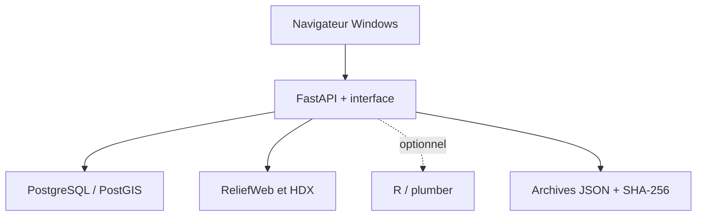

# Humanitarian Data Platform

Version de référence : **1.5.0** — application locale pour Windows 10/11 x64.

Humanitarian Data Platform (HDP) fournit une interface web locale pour rechercher des données humanitaires publiques, archiver les réponses avec leur provenance et préparer leur analyse. L'installateur Windows configure un socle FastAPI, PostgreSQL/PostGIS, Docker Compose et, en option, R/plumber.

> État du projet : MVP local validé sur Windows 11. Cette version n'est pas un serveur de production et ne doit pas être exposée directement à Internet.

## Fonctions disponibles

- recherche de jeux de données via HDX/CKAN ;
- recherche de rapports ReliefWeb avec un `appname` pré-approuvé ;
- archivage local des réponses JSON et calcul d'une empreinte SHA-256 ;
- enregistrement de la provenance dans PostgreSQL/PostGIS ;
- historique des acquisitions accessible par l'API ;
- service analytique R/plumber facultatif ;
- installation graphique Windows avec détection des dépendances, téléchargement explicite des logiciels tiers et choix automatique d'un port local disponible ;
- script de diagnostic Windows produisant un journal borné dans le temps.

## Installation rapide

1. Téléchargez et décompressez [`HumanitarianDataPlatform_Windows_v1.5.zip`](dist/HumanitarianDataPlatform_Windows_v1.5.zip).
2. Vérifiez l'empreinte de l'exécutable :

   ```powershell
   Get-FileHash .\HumanitarianDataPlatform_Setup_Native_GUI_v1.5.exe -Algorithm SHA256
   ```

   Valeur attendue :

   ```text
   1e77042dbbd7a7d400c690076bc61e3c7191c5e928cdb016a39292af2a362470
   ```

3. Ouvrez Docker Desktop s'il est déjà installé.
4. Lancez `HumanitarianDataPlatform_Setup_Native_GUI_v1.5.exe`.
5. Choisissez uniquement les composants souhaités, confirmez l'installation, puis laissez l'installateur ouvrir l'interface dans le navigateur.

L'application utilise `http://localhost:8080` si le port est libre ; sinon elle choisit automatiquement un port entre `18080` et `18279`. Le port effectif est enregistré dans `%USERPROFILE%\HumanitarianDataPlatform\.env` sous `HDP_PORT`.

Consultez la [procédure d'installation détaillée](docs/INSTALLATION.md) avant la première utilisation.

## Architecture



Seul le port de FastAPI est publié, exclusivement sur `127.0.0.1`. PostgreSQL et R restent internes au réseau Docker Compose.

## Documentation

- [Installation et première utilisation](docs/INSTALLATION.md)
- [Architecture, API et données](docs/ARCHITECTURE.md)
- [Construction et validation](docs/DEVELOPMENT.md)
- [Sécurité et confidentialité](docs/SECURITY.md)
- [Diagnostic et dépannage](docs/TROUBLESHOOTING.md)
- [Inventaire des livrables](docs/ARTIFACTS.md)
- [Notice détaillée PDF, 23 pages](dist/Notice_detaillee_Humanitarian_Data_Platform_v1.5.pdf)
- [Prompt exhaustif de reprise dans une nouvelle instance GPT+](dist/HDP_Prompt_exhaustif_reprise_GPT_Plus_v1.5.txt)

## Organisation du dépôt

```text
.
├── dist/       Livrables v1.5, archives, empreintes et notice PDF
├── docs/       Documentation Markdown consultable sur GitHub
├── source/     Sources extraites de l'application et de l'installateur
└── tools/      Générateur reproductible de la notice PDF
```

Le ZIP source original est conservé dans `dist/`, tandis que son contenu est également extrait dans `source/` afin de permettre la consultation et le suivi des modifications depuis GitHub.

## Limites actuelles

- les ressources jointes aux jeux HDX ne sont pas encore téléchargées ;
- aucune planification d'acquisitions ni reprise automatique sur erreur ;
- PostGIS est activé, mais aucune carte ni table géométrique n'est encore exploitée ;
- le service R ne propose qu'un résumé descriptif et n'est pas encore relié à un panneau d'analyse dans l'interface ;
- pas d'authentification, de TLS, de chiffrement applicatif ni de mode multi-utilisateur ;
- aucune licence HDP explicite n'est incluse dans la version 1.5.

## Licence

La version 1.5 ne contient pas de fichier de licence. Aucun droit de redistribution ou statut open source ne doit être déduit. Le dépôt doit rester privé tant qu'une licence n'a pas été choisie et ajoutée explicitement.
