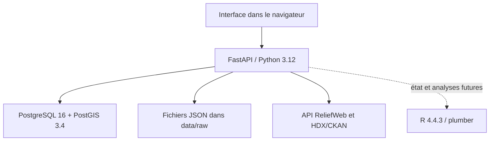

# Architecture, API et données

## Vue d'ensemble



Docker Compose orchestre les services. Le port Windows de l'API est publié uniquement sur `127.0.0.1`. PostgreSQL n'a aucun port hôte et R utilise uniquement le réseau interne Compose.

## Composants

| Composant | Implémentation v1.5 | Rôle |
|---|---|---|
| Installateur | C/Win32, PE32+ GUI x86-64 | Analyse de l'environnement, dépendances, déploiement, journalisation et ouverture du navigateur |
| API | Python 3.12, FastAPI 0.116.1, Uvicorn 0.35.0 | Validation, connecteurs, archivage et provenance |
| Client HTTP | httpx 0.28.1 | Appels HTTPS à ReliefWeb et HDX |
| Base | PostgreSQL 16 + PostGIS 3.4 | Métadonnées d'acquisition et socle géospatial |
| Accès SQL | psycopg 3.2.9 | Initialisation et requêtes PostgreSQL |
| Analyses | R 4.4.3, plumber, jsonlite | Service analytique facultatif |
| Orchestration | Docker Compose | Réseau, volume, profils et contrôles de santé |

## Services Compose

### `api`

- construit depuis `source/payload/api` ;
- reçoit `DATABASE_URL`, `DATA_DIR`, `R_SERVICE_URL` et `RELIEFWEB_APPNAME` ;
- monte le dossier Windows `data` dans `/app/data` ;
- publie `127.0.0.1:${HDP_PORT}:8080` ;
- attend que PostgreSQL soit sain avant son démarrage.

### `db`

- image `postgis/postgis:16-3.4` ;
- base et utilisateur `humanitarian` ;
- mot de passe injecté depuis `.env` ;
- volume nommé `postgres_data` ;
- aucun port publié sur Windows.

### `r-service`

- construit depuis `source/payload/r-service` ;
- profil Compose `analytics` ;
- port `8001` exposé seulement dans le réseau interne ;
- facultatif pour le fonctionnement du cœur Python/PostGIS.

## API locale

| Méthode et route | Rôle | Effet |
|---|---|---|
| `GET /` | Interface HTML | Affiche le formulaire de recherche |
| `GET /api/health` | Santé API et SQL | Vérifie aussi la connexion PostgreSQL |
| `GET /api/sources` | Sources déclarées | Retourne ReliefWeb et HDX/CKAN |
| `GET /api/search` | Recherche et archivage | Écrit un JSON et une ligne de provenance |
| `GET /api/acquisitions` | Historique | Retourne jusqu'à 200 acquisitions |
| `GET /api/analysis/status` | État de R | Retourne `ok` ou `not_started` |
| `GET /docs` | Swagger UI | Documentation interactive générée |
| `GET /openapi.json` | OpenAPI | Schéma lisible par machine |

Attention : `/api/search` déclenche une acquisition. L'utiliser comme test répétitif crée des archives en double.

## Flux d'acquisition

1. FastAPI valide `source`, `query` et `limit`.
2. Le connecteur appelle la source distante en HTTPS.
3. La réponse JSON est décodée, puis re-sérialisée en UTF-8 avec les clés triées.
4. Un UUID et une date UTC sont créés.
5. Le JSON est écrit sous :

   ```text
   data/raw/<source>/YYYYMMDDTHHMMSSZ_<requete>_<uuid>.json
   ```

6. SHA-256 est calculé sur les octets réellement archivés.
7. La provenance est enregistrée dans la table `acquisitions`.

## Schéma de provenance

| Colonne | Type | Sens |
|---|---|---|
| `id` | UUID | Identifiant primaire de l'acquisition |
| `source` | TEXT | `reliefweb` ou `hdx` |
| `query` | TEXT | Requête saisie |
| `retrieved_at` | TIMESTAMPTZ | Date UTC |
| `sha256` | CHAR(64) | Empreinte du JSON archivé |
| `item_count` | INTEGER | Nombre de résultats simplifiés |
| `raw_path` | TEXT | Chemin relatif sous `data` |

L'empreinte permet de détecter une modification ultérieure du fichier archivé. Elle ne prouve ni l'exactitude de la source distante, ni son exhaustivité, ni une origine juridique.

## Module R

Le service R expose actuellement :

- `GET /health` : état, langage et version ;
- `GET /summary?values=...` : effectif, moyenne, écart-type, médiane, minimum et maximum.

FastAPI relaie uniquement l'état du service. La route `/summary` n'est pas encore exposée dans l'API publique ni dans l'interface.
