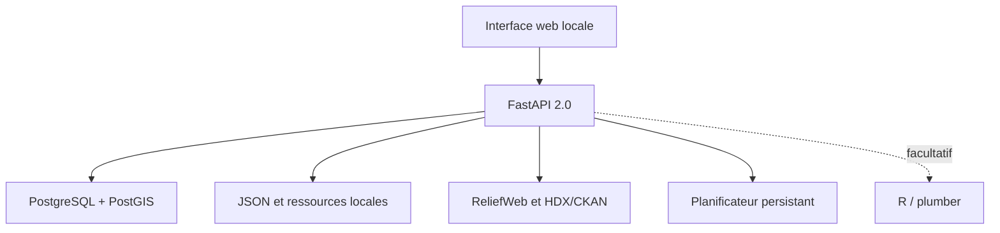

# Architecture, données et API

## Vue d'ensemble



Docker Compose orchestre l'API, PostgreSQL/PostGIS et le service R facultatif. Seul le port HTTP de l'API est publié sur `127.0.0.1`. PostgreSQL et R restent dans le réseau interne Compose.

## Modèle par projets

| Entité | Rôle | Suppression |
|---|---|---|
| `projects` | Conteneur fonctionnel | Archivage logique ; le projet par défaut est protégé |
| `project_preferences` | Limites et téléchargement automatique par défaut | Suit le projet |
| `acquisitions` | Provenance de chaque réponse distante | Conservée |
| `local_resources` | URL, état, chemin, taille et empreinte d'un fichier | Fichier supprimé, ligne marquée `deleted` |
| `project_scripts` | Contenu de scripts par projet | Archivage logique ; aucune exécution |
| `schedules` | Définition périodique d'une acquisition | Désactivation et archivage logique |
| `schedule_runs` | Historique des passages | Conservé avec statut et erreur éventuelle |

Le projet par défaut utilise l'UUID stable `00000000-0000-4000-8000-000000000001`. Le démarrage crée les nouvelles tables de façon idempotente, ajoute `project_id` et `schedule_id` à l'historique v1.5, puis rattache les lignes sans projet.

## Flux d'acquisition et de téléchargement

1. L'API valide le projet, la source, la requête et la limite.
2. Elle appelle ReliefWeb V2 ou l'Action API CKAN de HDX.
3. La réponse brute est sérialisée en UTF-8, archivée et hachée en SHA-256.
4. Une ligne `acquisitions` conserve la provenance.
5. Si le téléchargement est actif, l'API extrait les ressources référencées.
6. Elle applique les préférences : nombre maximal, taille maximale et formats autorisés.
7. Chaque URL et chaque redirection doivent viser une adresse IP publique.
8. Le fichier est écrit sous forme `.part`, contrôlé pendant le flux, puis renommé atomiquement.
9. Le chemin relatif, la taille, le type de contenu et l'empreinte SHA-256 sont enregistrés.

```text
data/raw/<project_uuid>/<source>/<horodatage>_<requete>_<acquisition_uuid>.json
data/projects/<project_uuid>/resources/<acquisition_uuid>/<resource_uuid>_<nom>
```

## Planificateur

Le planificateur est une tâche de fond de l'unique processus Uvicorn. Il interroge PostgreSQL toutes les 20 secondes. Une ligne due est revendiquée dans une transaction avec `FOR UPDATE SKIP LOCKED`; son prochain passage est avancé avant l'appel distant. Le résultat et l'erreur éventuelle sont écrits dans `schedule_runs`.

L'intervalle est compris entre 15 minutes et 30 jours. Une erreur de base temporaire ne termine pas définitivement la boucle. L'architecture suppose un seul processus API ; déployer plusieurs workers nécessiterait un service de tâches dédié.

## API locale principale

| Méthode et route | Fonction |
|---|---|
| `GET /api/health` | Santé SQL, version et état du planificateur |
| `GET/POST /api/projects` | Liste et création des projets |
| `PATCH/DELETE /api/projects/{id}` | Modification ou archivage logique |
| `GET/PUT /api/projects/{id}/preferences` | Préférences de téléchargement |
| `GET /api/search` | Acquisition manuelle et téléchargement optionnel |
| `GET /api/acquisitions?project_id=...` | Historique du projet |
| `GET /api/resources?project_id=...` | Inventaire local |
| `GET /api/resources/{id}/file` | Téléchargement depuis le stockage local |
| `POST /api/resources/{id}/verify` | Recalcul SHA-256 en flux |
| `DELETE /api/resources/{id}` | Suppression locale avec trace conservée |
| `GET/POST /api/projects/{id}/scripts` | Bibliothèque de scripts |
| `PATCH/DELETE /api/scripts/{id}` | Modification ou archivage d'un script |
| `GET/POST /api/projects/{id}/schedules` | Liste et création des planifications |
| `PATCH/DELETE /api/schedules/{id}` | Modification ou archivage |
| `POST /api/schedules/{id}/run` | Exécution manuelle immédiate |
| `GET /api/schedules/{id}/runs` | Historique d'exécution |
| `GET /docs` | Swagger UI générée par FastAPI |

`GET /api/search` et `POST /api/schedules/{id}/run` ont des effets : ils créent une acquisition et peuvent télécharger des fichiers.

## Service R

Le profil `analytics` fournit toujours R/plumber avec `/health` et `/summary`. Il reste facultatif et séparé du planificateur Python.

## Références des sources distantes

- [CKAN Action API](https://docs.ckan.org/en/latest/api/) : actions `package_search`, réponses `success/result` et métadonnées de ressources ;
- [ReliefWeb API V2](https://apidoc.reliefweb.int/) et [paramètres](https://apidoc.reliefweb.int/parameters) : appname, profils, requêtes, limites et quotas.
