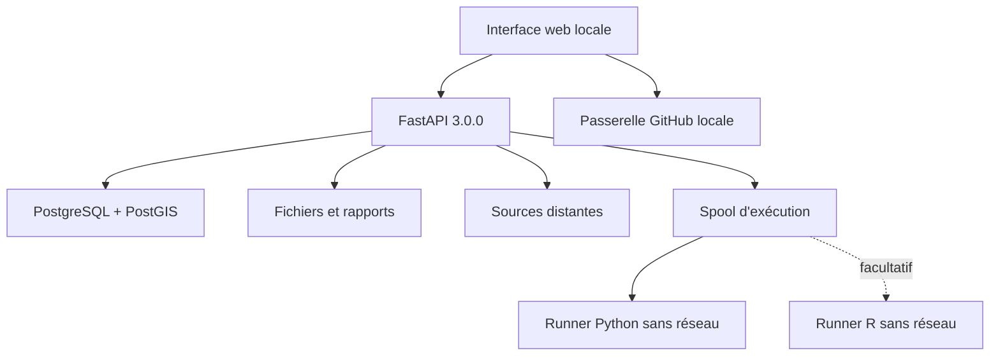

# Architecture, données et API

## Vue d'ensemble



Docker Compose orchestre l'API, PostgreSQL/PostGIS, le runner Python et les
services R facultatifs. Les ports HTTP de l'API et de la passerelle GitHub sont
publiés uniquement sur `127.0.0.1`.
PostgreSQL et R/plumber restent dans le réseau interne Compose ; les deux
runners utilisent `network_mode: none`.

## Modèle par projets

| Entité | Rôle | Suppression |
|---|---|---|
| `projects` | Conteneur fonctionnel | Archivage logique ; le projet par défaut est protégé |
| `project_preferences` | Limites et téléchargement automatique par défaut | Suit le projet |
| `project_github_settings` | Propriétaire, dépôt, description, visibilité et URL créée ; aucun jeton | Suit le projet |
| `project_geodata_settings` | Familles COD, pays/zone M49, politique, format et cycle | Automatisation désactivée à l'archivage |
| `source_global_settings` | Activation, délai et reprises par connecteur | Conservé globalement |
| `project_source_settings` | Contrat API, valeurs et planification par projet/source | Suit le projet |
| `schema_migrations` | Historique des migrations appliquées | Conservé |
| `acquisitions` | Provenance de chaque réponse distante | Conservée |
| `local_resources` | URL, empreinte et provenance famille/M49/ISO3/COD/licence | Fichier supprimé, ligne marquée `deleted` |
| `project_scripts` | État courant des scripts par projet | Archivage logique |
| `project_execution_settings` | Activation Python/R et limites du projet | Suit le projet |
| `script_versions` | Versions immuables et empreintes du code | Conservées avec le script |
| `script_executions` | État, sorties et rapport SHA-256 | Historique conservé |
| `rss_subscriptions` / `rss_items` | Veille officielle et éléments dédupliqués | Abonnement archivable |
| `map_layers` / `map_features` | Couches et géométries PostGIS SRID 4326 | Suit le projet |
| `schedules` | Définition périodique d'une acquisition | Désactivation et archivage logique |
| `schedule_runs` | Historique des passages | Conservé avec statut et erreur éventuelle |

Le projet par défaut utilise l'UUID stable `00000000-0000-4000-8000-000000000001`. Le démarrage crée les nouvelles tables de façon idempotente, ajoute `project_id` et `schedule_id` à l'historique v1.5, puis rattache les lignes sans projet.

## Intégrations de projet 3.0.0

Le registre `source_registry.py` décrit chaque API au moyen d'un contrat
versionné inspiré de JSON Schema. L'interface génère les champs depuis ce
contrat. L'API valide à nouveau toutes les valeurs, fusionne le modèle du projet
avec les valeurs d'exécution, applique les limites globales et archive la
configuration effective avec la réponse brute.

La création GitHub utilise `POST /user/repos` lorsque le propriétaire est vide ou correspond au compte du jeton, sinon `POST /orgs/{org}/repos`. Le dépôt est privé par défaut et initialisé avec un README. `GITHUB_TOKEN` demeure une variable d'environnement globale ; il ne transite jamais dans les modèles de réponse.

Le profil appelle `package_search` pour les catalogues canoniques `cod-ab-*` et
`cod-ps-*`. Chaque jeu doit correspondre à la série officielle ou à
l'identifiant exact `<famille>-<iso3>`, avec un unique groupe ISO3 connu de ONU
M49. COD-AB exige `cod-enhanced` ou `cod-standard`; COD-PS accepte l'absence de
ce champ, qui n'est pas publié uniformément pour cette série.

`GET /api/cod/availability` calcule l'intersection des ISO3 valides pour les
familles sélectionnées, la convertit en pays ou zones M49 et met les catalogues
en cache pendant 30 minutes. Au 7 août 2026, la même règle retourne 163 pays ou
zones COD-AB, 146 COD-PS et 143 dans leur intersection. COD-CS utilise un
registre versionné, actuellement vide et donc non sélectionnable. COD-HP est
explicitement retiré et ne peut pas être ajouté au profil.

Lorsqu'une famille, un pays, une politique COD ou un format change, le dernier résultat
est invalidé (`sync_required`) avant toute nouvelle synchronisation. L'interface
ne peut ainsi pas associer l'erreur d'un ancien pays au nouveau périmètre.

Les réponses CKAN complètes, le pays M49, les familles, les jeux retenus, les
absences et les formats manquants sont archivés sous `hdx-geodata`. Si une
famille sélectionnée manque, aucun sous-ensemble n'est téléchargé. Une ressource
déjà complète ne consomme pas le quota ; les suivantes obtiennent le compte
`deferred` et sont reprises lors d'un passage ultérieur.

## Flux d'acquisition et de téléchargement

1. L'API valide le projet, la source, la requête et la limite.
2. Elle appelle le connecteur choisi : ReliefWeb, HDX/CKAN, OMS/GHO,
   Banque mondiale/WDI, UNICEF/SDMX, ONU/ODD ou DHS.
3. La réponse brute est sérialisée en UTF-8, archivée et hachée en SHA-256.
4. Une ligne `acquisitions` conserve la provenance.
5. Si le téléchargement est actif, l'API extrait les ressources référencées.
6. Elle applique les préférences : nombre maximal, taille maximale et formats autorisés.
7. Chaque URL et chaque redirection doivent viser une adresse IP publique.
8. Le fichier est écrit sous forme `.part`, contrôlé pendant le flux, puis renommé atomiquement.
9. Le chemin relatif, la taille, le type de contenu et l'empreinte SHA-256 sont enregistrés.

```text
data/raw/<project_uuid>/<source>/<horodatage>_<requete>_<acquisition_uuid>.json
data/projects/<project_uuid>/resources/<acquisition_uuid>/<resource_uuid>_<nom>
```

## Exécution locale des scripts

L'API écrit atomiquement un job dans un volume spool. Un runner C distinct le
réclame par renommage, lance directement Python ou R avec `execve` — jamais via
un shell — puis écrit statut, sortie et horodatages. Le collecteur persiste le
résultat et un rapport JSON sous `data/projects/<projet>/executions`.

Les conteneurs sont non privilégiés, en lecture seule hors `/tmp` et du spool,
sans réseau, avec limites de processus, mémoire, CPU, durée, descripteurs et
taille de sortie. Cette frontière vise une application locale mono-utilisateur :
elle ne transforme pas HDP en plateforme d'exécution de code hostile.

## RSS, cartographie et chronologie

Le registre RSS ne contient que quatre URL ReliefWeb vérifiées. Les lectures
sont bornées, suivent uniquement les hôtes autorisés, utilisent ETag et
Last-Modified, refusent DTD/entités XML et dédupliquent par identifiant externe.

L'import cartographique accepte un Feature ou FeatureCollection GeoJSON borné,
stocke les géométries en PostGIS et expose un FeatureCollection limité à
5 000 entités. Leaflet 1.9.4 est servi depuis le payload local. Le fond OSM reste
opt-in. L'export produit GeoJSON et scripts d'import QGIS/R.

## Passerelle GitHub

Le service `github-api` expose sur le port local 8091 un sous-ensemble explicite
de l'API REST GitHub. Les lectures couvrent dépôt, branches, commits, issues,
pull requests, releases, workflows, contenus et quota. Les deux écritures
admises - création d'issue et déclenchement manuel de workflow - passent par un
verrou serveur désactivé par défaut. Le jeton n'est jamais renvoyé au client.

Cette passerelle est séparée de la création confirmée d'un dépôt dans l'API
principale. Son conteneur est non privilégié, en lecture seule et lié à
`127.0.0.1`. Elle ne doit pas être exposée sur un réseau partagé.

## Planificateur

Le planificateur est une tâche de fond de l'unique processus Uvicorn. Il
interroge PostgreSQL toutes les 20 secondes, collecte les jobs Python/R et
revendique les acquisitions, synchronisations géographiques ou lectures RSS
dues avec `FOR UPDATE SKIP LOCKED`. Le prochain passage est avancé avant l'appel
distant et le résultat est persisté.

L'intervalle est compris entre 15 minutes et 30 jours. Une erreur de base temporaire ne termine pas définitivement la boucle. L'architecture suppose un seul processus API ; déployer plusieurs workers nécessiterait un service de tâches dédié.

## API locale principale

| Méthode et route | Fonction |
|---|---|
| `GET /api/health` | Santé SQL, version et état du planificateur |
| `GET /api/sources` | Catalogue des connecteurs actifs et portails de référence |
| `GET/POST /api/projects` | Liste et création des projets |
| `PATCH/DELETE /api/projects/{id}` | Modification ou archivage logique |
| `GET/PUT /api/projects/{id}/preferences` | Préférences de téléchargement |
| `GET/PUT /api/projects/{id}/github` | Paramètres GitHub sans secret |
| `POST /api/projects/{id}/github/repository` | Création confirmée du dépôt |
| `GET/PUT /api/projects/{id}/geodata` | Profil géographique et état de synchronisation |
| `POST /api/projects/{id}/geodata/sync` | Synchronisation HDX immédiate |
| `GET /api/cod/families` | Liste, état sélectionnable/retiré et registre COD-CS |
| `GET /api/cod/availability` | Intersection pays/zone ONU M49 × familles HDX |
| `GET /api/un-m49/entities` | Nomenclature hiérarchique M49 et source d'autorité |
| `GET /api/search` | Acquisition manuelle et téléchargement optionnel |
| `GET /api/acquisitions?project_id=...` | Historique du projet |
| `GET /api/resources?project_id=...` | Inventaire local |
| `GET /api/resources/{id}/file` | Téléchargement depuis le stockage local |
| `POST /api/resources/{id}/verify` | Recalcul SHA-256 en flux |
| `DELETE /api/resources/{id}` | Suppression locale avec trace conservée |
| `GET/POST /api/projects/{id}/scripts` | Bibliothèque de scripts |
| `PATCH/DELETE /api/scripts/{id}` | Modification ou archivage d'un script |
| `GET /api/scripts/{id}/versions` | Versions immuables |
| `GET/POST /api/scripts/{id}/executions` | Historique et lancement Python/R |
| `GET /api/executions/{id}` | État et sortie d'un job |
| `GET /api/executions/{id}/report` | Rapport JSON de l'exécution |
| `GET/PUT /api/projects/{id}/execution-settings` | Limites et activation des runners |
| `GET /api/rss/catalog` | Registre RSS officiel |
| `GET/POST /api/projects/{id}/rss/subscriptions` | Abonnements du projet |
| `POST /api/rss/subscriptions/{id}/fetch` | Lecture RSS immédiate |
| `POST /api/resources/{id}/map/import` | Import GeoJSON dans PostGIS |
| `GET /api/projects/{id}/map/layers` | Couches cartographiques |
| `GET /api/map/layers/{id}/geojson` | Couche GeoJSON bornée |
| `GET /api/map/layers/{id}/export` | Archive QGIS/R |
| `GET /api/projects/{id}/timeline` | Événements Gantt |
| `GET/POST /api/projects/{id}/schedules` | Liste et création des planifications |
| `PATCH/DELETE /api/schedules/{id}` | Modification ou archivage |
| `POST /api/schedules/{id}/run` | Exécution manuelle immédiate |
| `GET /api/schedules/{id}/runs` | Historique d'exécution |
| `GET /docs` | Swagger UI générée par FastAPI |

`GET /api/search` et `POST /api/schedules/{id}/run` ont des effets : ils créent une acquisition et peuvent télécharger des fichiers.

## Service R

Le profil `analytics` fournit R/plumber avec `/health` et `/summary`, ainsi que
le runner R sans réseau. Les deux restent facultatifs.

## Références des sources distantes

- [CKAN Action API](https://docs.ckan.org/en/latest/api/) : actions `package_search`, réponses `success/result` et métadonnées de ressources ;
- [ONU M49](https://unstats.un.org/unsd/methodology/m49/overview/) : nomenclature statistique du monde, des régions, pays et zones ;
- [OCHA COD-AB](https://knowledge.base.unocha.org/wiki/spaces/imtoolbox/pages/2557378679/Administrative%2BBoundaries%2BCOD-AB) : limites administratives communes ;
- [OCHA Common Operational Datasets](https://knowledge.base.unocha.org/wiki/spaces/imtoolbox/pages/42045911/Common%2BOperational%2BDatasets%2BCODs) : familles COD actuelles et retrait de COD-HP ;
- [OCHA COD-CS](https://knowledge.base.unocha.org/wiki/spaces/imtoolbox/pages/2965897217/Country-specific%2BCODs%2BCOD-CS) : nature contextuelle des données spécifiques au pays ;
- [GitHub REST — repositories](https://docs.github.com/en/rest/repos/repos) : création pour un utilisateur ou une organisation ;
- [ReliefWeb RSS](https://reliefweb.int/rss) : flux officiels enregistrés ;
- [Leaflet 1.9.4](https://leafletjs.com/download.html) et [politique des tuiles OpenStreetMap](https://operations.osmfoundation.org/policies/tiles/) : rendu embarqué et fond opt-in ;
- [ReliefWeb API V2](https://apidoc.reliefweb.int/) et [paramètres](https://apidoc.reliefweb.int/parameters) : appname, profils, requêtes, limites et quotas.
- [WHO GHO OData API](https://www.who.int/data/gho/info/gho-odata-api),
  [World Bank Indicators API](https://datahelpdesk.worldbank.org/knowledgebase/articles/889392-about-the-indicators-api-documentation),
  [UNICEF SDMX API](https://data.unicef.org/sdmx-api-documentation/),
  [UN SDG API](https://unstats.un.org/sdgapi/swagger/) et
  [DHS Program API](https://api.dhsprogram.com/) : catalogues d'indicateurs et
  flux sanitaires ajoutés en 2.5.0.
