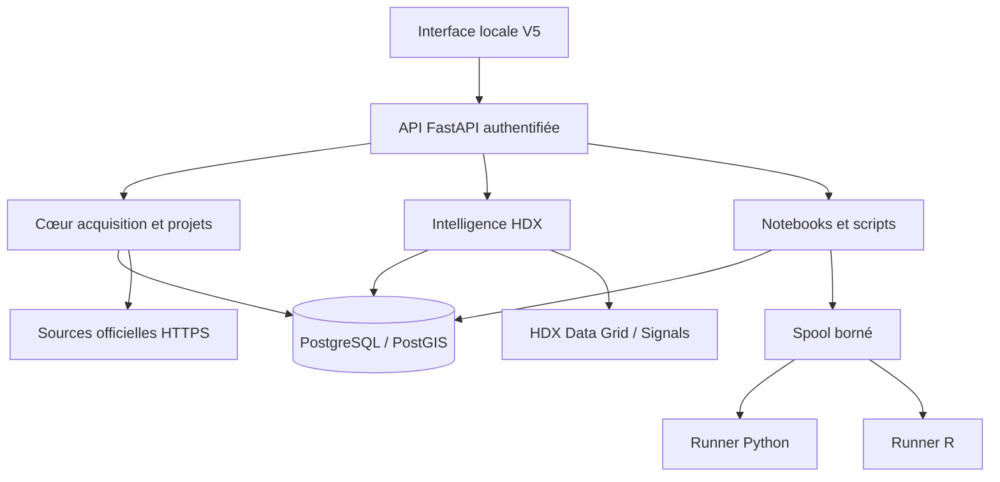
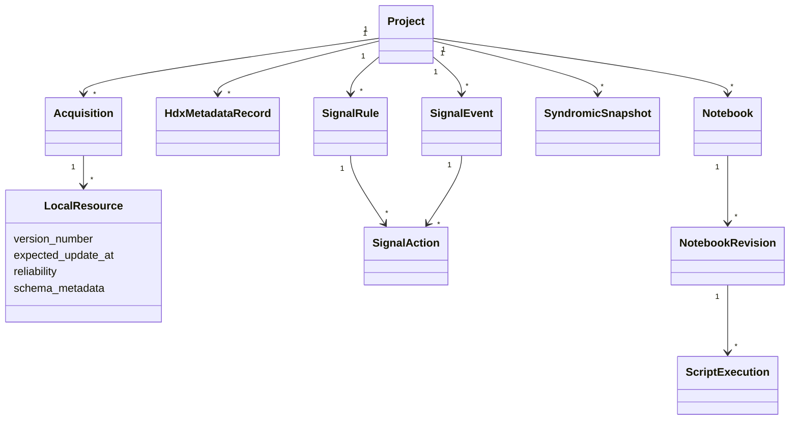
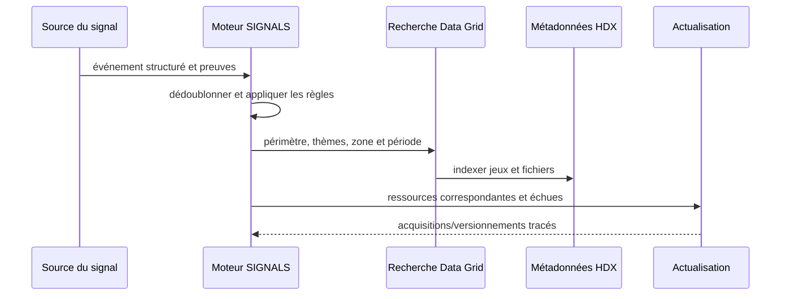

# Architecture et UML - HDP V5

La V5 conserve un monolithe modulaire : une interface, une API, un cœur PostgreSQL/PostGIS et deux runners. Le service GitHub secondaire a été retiré du déploiement car il dupliquait la logique et le secret. Les nouvelles fonctions résident dans `v5_features.py`; le fichier `main.py` conserve l’orchestration historique en vue d’une extraction progressive par domaines.

## Vue de composants

## Classes métier principales

## Séquence signal vers données

## Frontières de sécurité

- le navigateur doit présenter le secret de session local et un marqueur CSRF pour toute mutation ;
- l’API refuse les hôtes non autorisés et reste liée à la boucle locale ;
- les téléchargements épinglent une adresse IP publique validée, y compris après redirection ;
- le workspace SQL utilise `hdp_reader`, sans privilège, et une liste positive AST ;
- les runners n’ont aucun réseau, changent d’UID par job, tuent le groupe de processus et purgent le spool ;
- la restauration valide l’empreinte externe et le contenu avant extraction.
