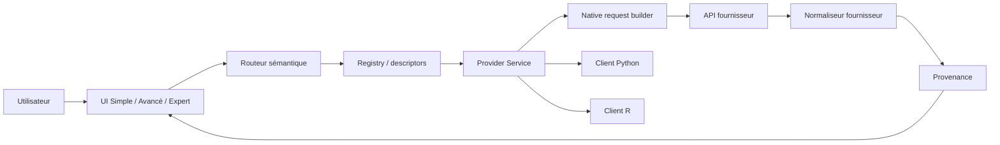
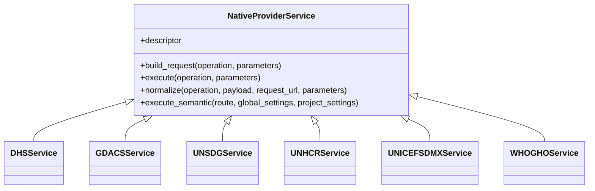

# HDP V7 — Architecture, structure, paramètres et UML des connecteurs

Commit de documentation : branche `feat/v7-six-connectors-qualified`. Ce document complète les rapports individuels et décrit le contrat commun des connecteurs V7.

## 1. Structure de référence

Chaque connecteur spécialisé est isolé sous `source/payload/api/app/providers/<provider>/` et s'appuie sur le socle `providers/base/native_service.py`. Les responsabilités sont séparées : `descriptor.py` décrit capacités/opérations/paramètres ; `service.py` construit la requête native, exécute et normalise ; `api.py` expose les routes spécialisées ; `vocabularies.py`, lorsqu'il existe, porte les correspondances vérifiées. Les normaliseurs GDACS, UNICEF SDMX et WHO GHO sont locaux à leur package fournisseur et ne dépendent pas de `app.main`.

## 2. Chaîne fonctionnelle

`USER INTENT -> HDP CANONICAL CONCEPT -> NOMENCLATURE -> PROVIDER CAPABILITY -> VERIFIED TRANSLATION -> PROVIDER VALUE -> NATIVE PARAM -> NATIVE REQUEST -> RESPONSE -> NORMALIZATION -> PROVENANCE -> UI/EXPORT`

Aucune conversion géographique ou sémantique n'est inventée. Une correspondance non démontrée doit être bloquée et tracée.

## 3. UML — composants

## 4. UML — classes

## 5. Paramètres et périmètre des six connecteurs qualifiés

### DHS
Opérations : catalogue indicateurs, données indicateurs, pays, enquêtes. Paramètres natifs utilisés selon opération : `f`, `page`, `perpage`, `indicatorIds`, `countryIds`, `surveyYears`, `breakdown`. La géographie ISO3 est résolue via le catalogue DHS officiel avant construction de `countryIds`; elle n'est jamais convertie arbitrairement.

### GDACS
Opération qualifiée : recherche/liste d'événements. Paramètres exposés selon le descriptor : notamment `alertlevel` et contrôles de requête documentés. Les filtres géographiques dont la sémantique native n'est pas vérifiée restent bloqués plutôt qu'émulés.

### UN SDG
Opérations de catalogue et interrogation de l'API SDG. La géographie utilise une correspondance vérifiée vers M49 lorsque l'opération l'exige ; exemple qualifié : Rwanda -> M49 `646` -> `areaCode=646`. Une opération documentée peut légitimement avoir zéro paramètre et l'auditeur le reconnaît.

### UNHCR
Opérations de catalogue et données de population. Paramètres natifs principaux : `cf_type`, `limit`, `page`, `yearFrom`, `yearTo`, plus paramètres d'origine/asile lorsque l'opération les supporte. Les rôles `origin` et `asylum` restent distincts.

### UNICEF SDMX
Périmètre qualifié : découverte SDMX/dataflows et transport SDMX. Paramètres natifs principaux : `detail`, `format`, `references`, avec clés/chemins dépendant du dataflow. La traduction générique géographie/période vers une clé d'observation n'est pas déclarée exhaustive tant que `dataflow -> DSD -> dimensions -> codelists -> key` n'est pas résolu et vérifié.

### WHO GHO
Périmètre qualifié : catalogue et interrogation OData GHO legacy. Paramètres natifs principaux : `$filter`, `$format`, `$skip`, `$top`. Ce contrat n'est pas présenté comme équivalent à toutes les API WHO modernes.

## 6. Paramètres transverses HDP

Les descriptors définissent types, cardinalités, valeurs/énumérations lorsque connues, valeurs par défaut, exposition par niveau UI et contraintes. Les paramètres vides ne sont pas envoyés. Les listes sont sérialisées selon le contrat natif du fournisseur. La provenance conserve opération, requête native et éléments de mapping utiles à la reproductibilité.

## 7. Sécurité et robustesse

Le transport commun applique les limites de réponse, les hôtes autorisés et les contrôles HTTP du socle fournisseur. Les paramètres non supportés ne doivent pas contaminer un autre connecteur. Les secrets éventuels sont référencés par variables d'environnement et ne sont pas intégrés dans les exemples exportés.

## 8. Qualification

La qualification comprend contrats unitaires, 10 cycles déterministes par connecteur, sentinelles live non destructives, régressions backend, clients Python/R, routeur sémantique, UI, audit global et construction Windows. Un test non exécuté ne vaut jamais PASS. Les limites de couverture restent documentées dans les rapports `FINAL_REPORT.md` individuels.
