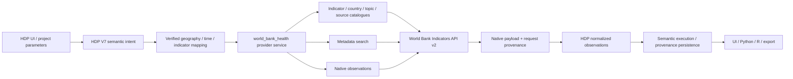

# HDP V7 — World Bank Health connector architecture

## Architectural objective

Provide a provider-native World Bank Indicators API v2 adapter that follows the V7 provider architecture established by ReliefWeb while retaining compatibility with the existing HDP semantic router.

## Components

## Package structure

- `app/providers/base/contracts.py`: common provider descriptor/configuration model inherited from the ReliefWeb architecture.
- `app/providers/world_bank_health/descriptor.py`: World Bank provider identity, evidence, operations, parameters and capabilities.
- `app/providers/world_bank_health/service.py`: provider-native request construction, HTTP acquisition, catalogue operations, observation normalization and geography safety guard.
- `semantic_provider_execution.py`: pre-existing V7 semantic World Bank path; remains the semantic entry point in this branch. Its behavior is regression-tested by the V7 semantic suite. The dedicated provider package defines the reference contract for further consolidation.
- `source_registry.py`: legacy V6-origin source/project schema still exposes the existing World Bank fields. Its registry version remains `6.0.0`; this connector work does not falsely relabel that whole registry as V7.
- `tools/v7_world_bank_health_use_case_qualification.py`: deterministic 10-cycle-per-feature gate.
- `tools/v7_world_bank_health_live_acceptance.py`: non-destructive live provider gate.
- `.github/workflows/world-bank-health-v7.yml`: connector-specific CI qualification.

## Functional decomposition

### Catalogue discovery

WDI source `2` is the health/development default. HDP can list the source indicator catalogue and perform deterministic keyword discovery over code, label, source note and source organization. The actual observation request uses selected provider indicator codes rather than free-text guessing.

### Geography

Canonical HDP geography resolves to verified sovereign ISO3 for the sovereign-country path. Multi-country requests use the provider semicolon delimiter. World Bank aggregates are explicitly separated from sovereign-country semantics.

### Time

The qualified semantic profile supports annual single years and year ranges. Provider-native request construction additionally represents MRV, MRNEV, gap-fill and frequency controls. High-frequency/YTD forms are documented but are not automatically inferred from generic HDP dates.

### Metadata / ancillary sources

Country, topic, source, indicator metadata and metadata keyword-search endpoints are represented separately so that provider nomenclatures can be discovered rather than hard-coded from labels.

### Normalization

The JSON observation response is normalized into an HDP item containing stable identity fields, title, period, geography, indicator code/name, value, observation status, source/organization and a `_native` copy of the provider row. The exact native request URL is retained.

## ReliefWeb / HDX pattern reuse

The implementation reuses these architectural principles from the qualified provider work:

1. provider-specific descriptor and service rather than a generic query that hides native semantics;
2. verified official-documentation evidence attached to the contract;
3. explicit provider configuration resolution;
4. provider-native request provenance;
5. deterministic tests separated from live provider acceptance;
6. false-zero prevention;
7. provider-specific nomenclature resolution rather than guessed cross-provider identifiers.

World Bank differs from ReliefWeb in that it is series/observation oriented rather than document oriented, and differs from HDX in that the principal V7 path retrieves structured observations rather than dataset packages/resources.

## Error model

- invalid sovereign geography: explicit validation error;
- known World Bank aggregate passed as sovereign ISO3: explicit semantic error;
- provider 4xx/5xx: provider error;
- timeout/network failure: acquisition error;
- malformed payload: normalization/acquisition error;
- no catalogue keyword match from a bounded candidate set: bounded/no-match state, never proof of universal absence;
- valid native zero-row observation response: only considered valid empty after request/mapping/completeness evidence is retained.

## Security / operational properties

The API is public and requires no API key. The connector uses HTTPS, bounded request parameters, explicit timeouts and the HDP user-agent. No credential is stored for this provider.

## Known architectural debt

The V7 semantic World Bank executor predates this dedicated provider package and still contains its own catalogue/observation orchestration. The two paths are covered by regression and provider tests, but a future consolidation should make the semantic executor delegate directly to `WorldBankHealthService` so one request implementation becomes the unique source of truth. This is recorded as technical debt rather than silently presented as complete refactoring.

The V6-origin `source_registry.py` also exposes fewer World Bank-native optional parameters than the dedicated V7 provider descriptor. Expanding UI/project schema exposure is a separate integration task and must be qualified before being described as exhaustive UI support.
